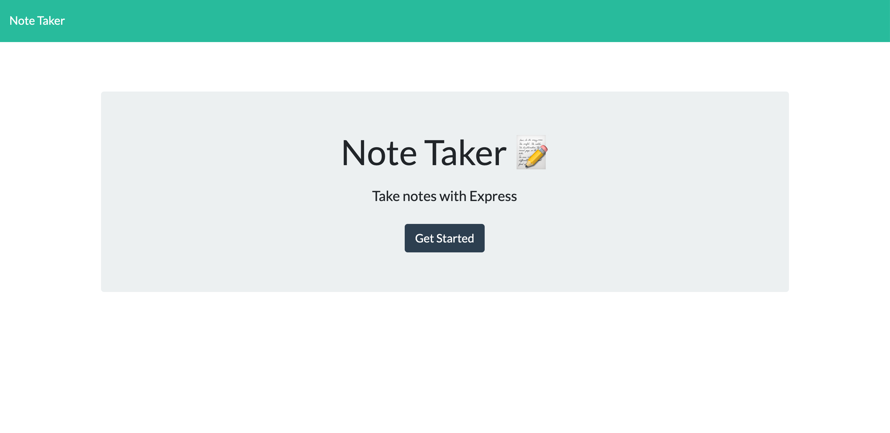
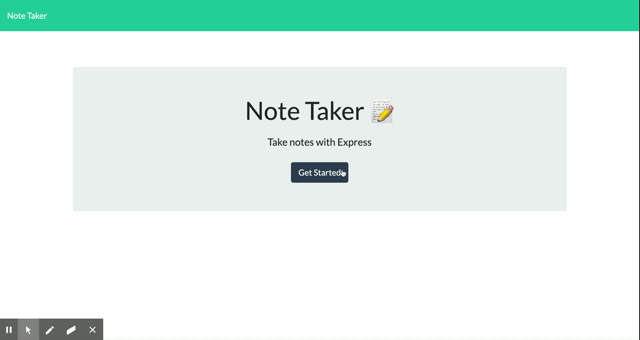

# Note Taker 📝

Note Taker was created for the person that likes to write things down. You'll never forget anything again and when you no longer need it, just delete it. This application utilizes API storage instead of session memory thanks to Express.js

Don't forget to get stuff done -- [write it down.](https://evening-thicket-45514.herokuapp.com/)

### Installation

Developers must clone the repository using their terminal/bash. They must also install `npm i` the correct dependencies, which are listed in the package.json file.

### Usage

The application is best used with nodemon.

### Deployed application

https://evening-thicket-45514.herokuapp.com/

### Github Repository

https://github.com/aliciavega731/note-taker

### Questions

If you have any other questions or concerns, please reach out via email aliciamvega94@gmail.com or via Github.